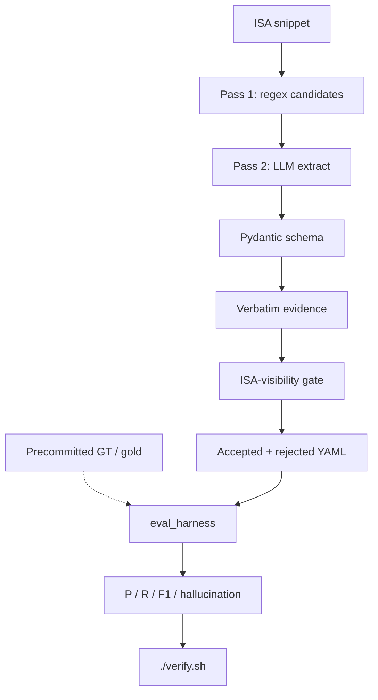
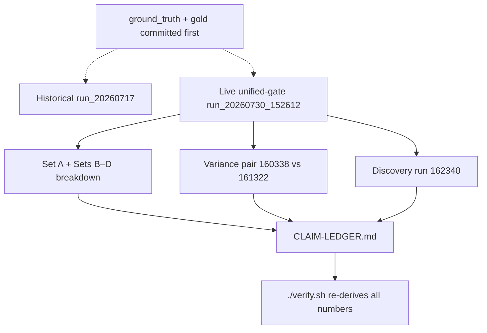

# RISC-V Architectural Parameter Extractor

[](https://www.python.org)
[](https://www.apache.org/licenses/LICENSE-2.0)
[](https://ollama.com)
[](https://docs.pydantic.dev/latest/)
[](https://lfx.linuxfoundation.org/)

**LFX Mentorship Coding Challenge — Part II** · **Author:** [Hitesh](https://github.com/Hiteshsai007)

Local, auditable extraction of implementation-defined RISC-V architectural parameters.
Every bold number re-derives from committed artifacts — no API keys, no model calls.

---

## Check it without trusting me

```bash
./verify.sh
# Windows:  powershell -File .\verify.ps1
# Optional: ./verify.sh --list
```

Offline. No API keys. No model calls. Re-derives every published number from
committed artifacts and fails if any disagree.

| Check | Command / artifact |
|-------|--------------------|
| Metrics re-derived | [`scripts/verify.py`](scripts/verify.py) |
| GT predates results | [`scripts/check_commit_order.py`](scripts/check_commit_order.py) |
| Evidence verbatim | [`src/validate_yaml.py`](src/validate_yaml.py) |
| Bad fixtures fail closed | [`tests/bad_examples/`](tests/bad_examples/) |
| Prompt leakage | [`scripts/check_prompt_leakage.py`](scripts/check_prompt_leakage.py) |
| Claim → artifact map | [`CLAIM-LEDGER.md`](CLAIM-LEDGER.md) |

---

## What this is (one screen)

**Input:** 30 ISA snippets (10 Set A + 20 forward-registered B–D)  
**Output:** accepted parameters + rejected candidates with reason codes  
**Model:** Qwen 2.5 7B Instruct (local Ollama), T=0, seed=42  
**Gates:** verbatim evidence · ISA-visibility · Pydantic · commit-order  
**Primary live run:** [`results/run_qwen_fast/`](results/run_qwen_fast/) (post-fix §8, unified gate)  
**Previous live run:** [`results/run_20260730_152612/`](results/run_20260730_152612/) (pre-fix unified gate)  
**Historical baseline:** [`results/run_20260717_053803/`](results/run_20260717_053803/) (**predates** `isa_visible` fields)

---

## Challenge deliverable map

| # | Challenge requirement | Proof |
|---|----------------------|-------|
| 1 | LLM details | [Deliverable 1](#deliverable-1) · [`config/default.yaml`](config/default.yaml) |
| 2 | Prompt files | [`prompts/`](prompts/) · [`prompts/CHANGELOG.md`](prompts/CHANGELOG.md) |
| 3 | Prompt engineering journey | [`EXPERIMENTS.md`](EXPERIMENTS.md) |
| 4 | Hallucination mitigation | [`src/validate_yaml.py`](src/validate_yaml.py) · [Architecture](#architecture) |
| 5 | Example YAML outputs | [Results](#results) · [`results/run_20260730_152612/`](results/run_20260730_152612/) |
| 6 | Source code | [`src/`](src/) |

---

## Architecture

Rendered SVG: [`docs/pipeline-architecture.svg`](docs/pipeline-architecture.svg)



### Commit-order / measurement integrity



`scripts/check_commit_order.py` enforces that ground truth / gold commit **before** results for each snippet.

| Gate | Blocks | Code |
|------|--------|------|
| Pass 1 regex | Non-trigger text never reaches the LLM | [`src/candidate_detector.py`](src/candidate_detector.py) |
| Verbatim evidence | Paraphrased / fabricated quotes | [`src/validate_yaml.py`](src/validate_yaml.py) |
| ISA-visibility | Microarchitectural noise without a real mnemonic | [`src/isa_verification.py`](src/isa_verification.py) (shared by live `extract.py` + audit) |
| Pydantic | Missing / illegal fields | [`schema/parameter_schema.py`](schema/parameter_schema.py) |
| Commit-order | Post-hoc label editing | [`scripts/check_commit_order.py`](scripts/check_commit_order.py) |

---

## Key findings

1. **Gold R1 contradiction fixed — capacity is `NOT_ISA_VISIBLE`.**
   Live gold rejects `cache_capacity_and_organization`; pre-correction snapshot kept for historical re-derivation —
   [`data/gold/positive_cases/cache_block_size.yaml`](data/gold/positive_cases/cache_block_size.yaml),
   [`data/gold/archive/pre_r1_fix/`](data/gold/archive/pre_r1_fix/).

2. **Forward registration falsified generalization.**
   Post-fix full-corpus F1 **0.2353**; Sets B–D first-eval F1 **0.0000**. Historical Set-A F1 0.4348 does not transfer —
   [`CLAIM-LEDGER.md`](CLAIM-LEDGER.md). Low B–D score is the *point* of preregistration: the pipeline is honest enough to fail.

3. **Discovery ≠ grounding.**
   v6 Set-A grounding recall **0.4444** vs v8 discovery exact-match recall **0.0000** (naming contamination from illustrative examples, not empty output) —
   [`results/run_20260730_160338/`](results/run_20260730_160338/),
   [`results/run_20260730_162340/`](results/run_20260730_162340/).
   Concrete misses: [`docs/ERROR_ANALYSIS.md`](docs/ERROR_ANALYSIS.md).

4. **ISA-visibility over-correction fixed (§8, 2026-07-31).**
   The hardened gate rejected the canonical `cache_block_size` parameter because the LLM generated a generic justification without citing a `CBO.*` instruction mnemonic. Fixed by:
   - **Prompt:** Added explicit rule requiring mnemonic citation in `visibility_justification`
   - **Gate:** Removed redundant double-check; `justification_cites_real_mnemonic()` is sufficient
   - **Result:** `cache_block_size` now accepted with `CBO.ZERO`/`CBO.CLEAN` citation. Full-corpus F1 improved from 0.1875 → **0.2353**.
   Details: [`EXPERIMENTS.md` §8](EXPERIMENTS.md#8-over-correction-fix--recover-cache_block_size-2026-07-31).

---

## Results

Every bold number maps to a committed artifact in [`CLAIM-LEDGER.md`](CLAIM-LEDGER.md).
Re-derive offline: `./verify.sh` · slice breakdown:
`python scripts/compute_eval_breakdown.py --results results/run_qwen_fast`

### Current (post-fix §8)

| Slice | P | R | F1 | Notes / source |
|-------|---|---|-----|----------------|
| **Full 30 (post-fix)** | 0.5000 | 0.1538 | **0.2353** | [`run_qwen_fast`](results/run_qwen_fast/) |
| **Set A (post-fix)** | 0.6667 | 0.4444 | **0.5333** | from post-fix run slice |
| **Sets B–D** | 0.0000 | 0.0000 | 0.0000 | forward-registered eval |
| Hallucination | — | — | 0% | substring check |

### Previous runs

| Slice | P | R | F1 | Notes / source |
|-------|---|---|-----|----------------|
| Historical Run 5 (archived gold overlay) | 0.3846 | 0.5000 | 0.4348 | pre-unified-gate · [`run_20260717_053803`](results/run_20260717_053803/) + [`archive/pre_r1_fix`](data/gold/archive/pre_r1_fix/) |
| Live full 30 (pre-fix gate) | 0.5000 | 0.1154 | 0.1875 | [`run_20260730_152612`](results/run_20260730_152612/) |
| Live Set A only (pre-fix) | 1.0000 | 0.3333 | 0.5000 | from pre-fix run slice |
| Grounding recall (v6) | — | 0.4444 | — | gold names in prompt · [`run_20260730_160338`](results/run_20260730_160338/) |
| Discovery recall (v8) | — | 0.0000 | — | zero eval gold names · [`run_20260730_162340`](results/run_20260730_162340/) |
| Variance ΔF1 | — | — | 0.0000 | identical config · [`160338`](results/run_20260730_160338/) vs [`161322`](results/run_20260730_161322/) |

Historical exact vs relaxed (Run 5 only): P 0.3846→0.5000, R 0.5000→0.6000, F1 0.4348→0.5455.

> **Falsification triggered:** |0.2353 − 0.4348| > 0.15. Set-A historical F1 does **not** generalize.

### Accepted examples (post-fix §8)

Accepted — [`cache_block_size.yaml`](results/run_qwen_fast/cache_block_size.yaml) (previously rejected, now recovered):

```yaml
- name: cache_block_size
  type: numeric_range
  isa_visible: true
  visibility_justification: CBO.ZERO and CBO.CLEAN operate on cache-block-sized granules,
    so the block size affects the address range of each instruction.
```

Accepted — [`wlrl_field_behavior.yaml`](results/run_qwen_fast/wlrl_field_behavior.yaml):

```yaml
- name: wlrl_supported_values
  type: field_behavior
  isa_visible: true
  visibility_justification: Software can read back the CSR with CSRRS to see which
    written values stick.
```

---

## Quick Start

```bash
git clone https://github.com/Hiteshsai007/riscv-param-extractor.git
cd riscv-param-extractor
pip install -r requirements.txt

./verify.sh                      # ← before any model step
python -m pytest tests/ -v

# Model-dependent (local Ollama + qwen2.5:7b-instruct)
python -m src.cli --health-check --config config/default.yaml
python -m src.cli --input data/raw_snippets/ --config config/default.yaml
python -m src.eval_harness --results results/<run_dir>/ --gold data/gold/ --snippets data/raw_snippets/
```

Discovery eval (zero gold names): `--config config/discovery.yaml`.

---

<a id="deliverable-1"></a>
## Deliverable 1 — LLM details

| Field | Value |
|-------|-------|
| Model | Qwen 2.5 7B Instruct (`qwen2.5:7b-instruct`) |
| Context | 8,192 tokens |
| Temperature | 0.0 |
| Seed | 42 |
| Runtime | Local Ollama |
| Config | [`config/default.yaml`](config/default.yaml) |

<a id="deliverable-2"></a>
## Deliverable 2 — Prompts & hallucination mitigation

`v1` → `v4` contrastive CoT → **`v6_decision_framework`** (evaluated) → `v8_discovery` (zero gold names).
Log: [`EXPERIMENTS.md`](EXPERIMENTS.md). Evidence must be a **verbatim** source substring
([`src/validate_yaml.py`](src/validate_yaml.py)).

---

## Project structure

```
riscv-param-extractor/
├── CLAIM-LEDGER.md
├── EXPERIMENTS.md
├── ground_truth.md
├── verify.sh / verify.ps1
├── config/                  # default.yaml, discovery.yaml
├── data/
│   ├── raw_snippets/        # 30 snippets
│   ├── ground_truth/        # R4 preregistration
│   ├── gold/                # grading (+ archive/pre_r1_fix/)
│   ├── eval_sets/set_a/
│   ├── udb_reference/
│   └── riscv_isa_index.json
├── docs/
│   ├── pipeline-architecture.svg
│   └── ERROR_ANALYSIS.md    # concrete misses (B–D / discovery)
├── prompts/                 # v1…v8 + CHANGELOG
├── results/
│   ├── run_20260717_053803/ # historical (pre-gate)
│   ├── run_20260730_152612/ # live unified-gate full 30 (pre-fix)
│   ├── run_qwen_fast/       # post-fix §8 full 30 (current primary)
│   ├── run_20260730_160338/ # Set A variance #1
│   ├── run_20260730_161322/ # Set A variance #2
│   ├── run_20260730_162340/ # discovery (v8)
│   └── udb/                 # format samples — no upstream PR
├── schema/parameter_schema.py
├── scripts/                 # verify.py, check_commit_order.py,
│                            # diagnose_cache_block.py, compute_eval_breakdown.py…
├── src/
└── tests/                   # + tests/bad_examples/
```

---

## Claims NOT being made

Full list: [`CLAIM-LEDGER.md`](CLAIM-LEDGER.md).

| Tempting claim | Reality |
|----------------|---------|
| Historical recall = discovery | Only `v8_discovery` is cold naming |
| Multi-model success | **Not claimed** — only Qwen post-gate artifacts are committed |
| Upstream UDB contribution | Format samples in [`results/udb/`](results/udb/); `cache_block_size` now accepted post-fix — UDB PR viable pending quality review |
| Historical F1 generalizes | Falsified (post-fix 30 F1 = 0.2353; B–D = 0) |

---

## License

Apache License 2.0
