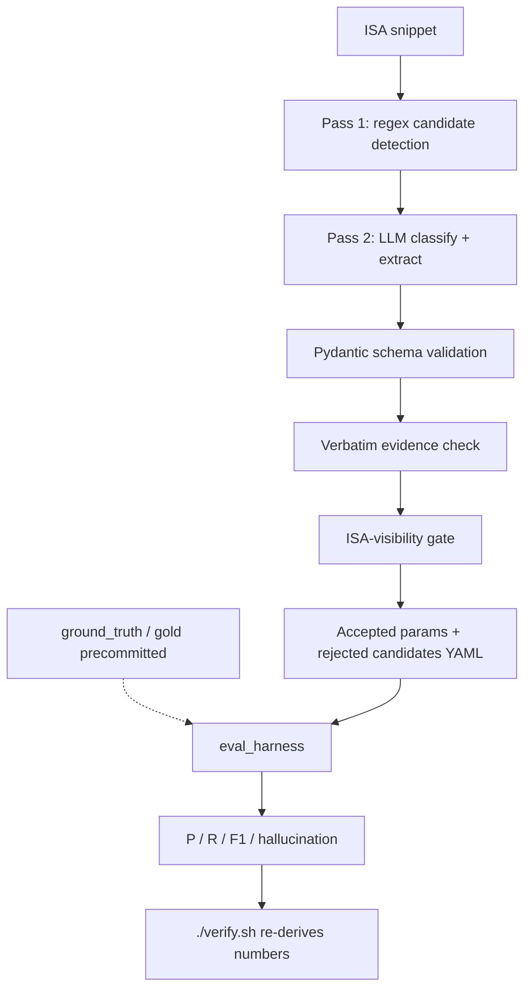
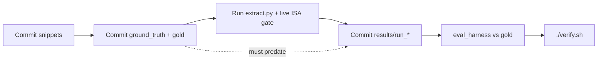

# RISC-V Architectural Parameter Extractor

[](https://www.python.org)
[](https://www.apache.org/licenses/LICENSE-2.0)
[](https://ollama.com)
[](https://docs.pydantic.dev/latest/)
[](https://lfx.linuxfoundation.org/)

**LFX Mentorship Coding Challenge — Part II** · **Author:** [Hitesh](https://github.com/Hiteshsai007)

Local, auditable extraction of implementation-defined RISC-V architectural parameters.
Every bold number re-derives from committed artifacts — no API keys, no model calls.

---

## Check it without trusting me

```bash
./verify.sh          # Linux/macOS / Git Bash
# or:  powershell -File .\verify.ps1
```

Offline. No API keys. No model calls. Re-derives every published number from committed
artifacts and fails if any disagree.

| What it checks | Where |
|----------------|-------|
| Metrics re-derived (historical + live) | [`scripts/verify.py`](scripts/verify.py) |
| GT predates results (R4 commit-order) | [`scripts/check_commit_order.py`](scripts/check_commit_order.py) |
| Evidence is verbatim | [`src/validate_yaml.py`](src/validate_yaml.py) |
| Bad fixtures fail closed | [`tests/bad_examples/`](tests/bad_examples/) |
| Prompt does not leak gold names (discovery) | [`scripts/check_prompt_leakage.py`](scripts/check_prompt_leakage.py) |
| Claim → artifact map | [`CLAIM-LEDGER.md`](CLAIM-LEDGER.md) |

---

## What this is (one screen)

| | |
|--|--|
| **Input** | 30 ISA snippets — Set A (10 evaluated) + Sets B–D (20 forward-preregistered) |
| **Output** | Structured YAML parameters + `rejected_candidates` with closed reason codes |
| **Model** | Qwen 2.5 7B Instruct via local Ollama · `temperature=0` · `seed=42` |
| **Gates** | Verbatim evidence · ISA-visibility (shared live/audit) · Pydantic schema · commit-order |
| **Primary live run** | [`results/run_20260730_152612/`](results/run_20260730_152612/) — **unified ISA gate** |
| **Historical baseline** | [`results/run_20260717_053803/`](results/run_20260717_053803/) — **predates** `isa_visible` fields |

---

## Challenge deliverable map

| # | Challenge requirement | Proof (one click) |
|---|----------------------|-------------------|
| 1 | LLM details | [Deliverable 1](#deliverable-1) · [`config/default.yaml`](config/default.yaml) |
| 2 | Prompt files | [`prompts/`](prompts/) · [`prompts/CHANGELOG.md`](prompts/CHANGELOG.md) |
| 3 | Prompt engineering journey | [`EXPERIMENTS.md`](EXPERIMENTS.md) |
| 4 | Hallucination mitigation | [`src/validate_yaml.py`](src/validate_yaml.py) · [Gates](#architecture) |
| 5 | Example YAML outputs | [Results](#results-live-unified-gate) · [`results/run_20260730_152612/`](results/run_20260730_152612/) |
| 6 | Source code | [`src/`](src/) |

---

## Architecture

Live pipeline (also rendered: [`docs/pipeline-architecture.svg`](docs/pipeline-architecture.svg)):



### Commit-order integrity (R4)

Ground truth and gold labels are committed **before** any pipeline results on the same snippets.
`scripts/check_commit_order.py` enforces this mechanically.



| Gate | What it blocks | Shared code |
|------|----------------|-------------|
| Pass 1 regex | Non-trigger sentences never reach the LLM | [`src/candidate_detector.py`](src/candidate_detector.py) |
| Verbatim evidence | Paraphrased / fabricated quotes | [`src/validate_yaml.py`](src/validate_yaml.py) |
| ISA-visibility | Microarchitectural “implementation-specific” noise | [`src/isa_verification.py`](src/isa_verification.py) — used by **both** `extract.py` and `scripts/verify_isa_claims.py` |
| Pydantic schema | Missing fields / illegal types | [`schema/parameter_schema.py`](schema/parameter_schema.py) |
| Commit-order | Post-hoc label editing after seeing outputs | [`scripts/check_commit_order.py`](scripts/check_commit_order.py) |

---

## Results (live unified gate)

**Source of truth for live numbers:** [`results/run_20260730_152612/`](results/run_20260730_152612/)
(`v6_decision_framework`, seed=42, temp=0, **current ISA-visibility gate**).

**Historical Run 5** ([`results/run_20260717_053803/`](results/run_20260717_053803/)) **predates** the unified gate
(`isa_visible` absent in those YAMLs). It remains re-derivable via archived pre-R1 gold —
see [CLAIM-LEDGER.md](CLAIM-LEDGER.md).

### Live corpus (exact match)

| Slice | Precision | Recall | F1 | Hallucination |
|-------|-----------|--------|-----|---------------|
| Full corpus (30) | 0.5000 | 0.1154 | 0.1875 | 0.0% |
| Set A only (10) | 1.0000 | 0.3333 | 0.5000 | 0.0% |
| Sets B–D (first forward-registered eval) | 0.0000 | 0.0000 | 0.0000 | 0.0% |

Re-derive: `python scripts/verify.py` · slice breakdown:
`python scripts/compute_eval_breakdown.py --results results/run_20260730_152612`

> **Falsification triggered:** live full-corpus F1 (0.1875) differs from historical Set-A F1 (0.4348)
> by more than ±0.15. Set-A-only historical numbers do **not** generalize to the expanded corpus.

### Historical Run 5 (exact vs relaxed)

Graded against **pre-R1 archived gold** (`data/gold/archive/pre_r1_fix/`).

| Metric | Exact Match | Relaxed (≥0.75 name sim) | Delta |
|--------|-------------|--------------------------|-------|
| **Precision** | 0.3846 | 0.5000 | +0.1154 |
| **Recall** | 0.5000 | 0.6000 | +0.1000 |
| **F1 Score** | 0.4348 | 0.5455 | +0.1107 |
| **Hallucination** | 0.0% | 0.0% | — |

### Grounding vs discovery recall (Set A)

| Recall type | Prompt | Run | Strict recall |
|-------------|--------|-----|---------------|
| **Grounding** (gold names in prompt) | [`v6_decision_framework`](prompts/v6_decision_framework.md) | [`run_20260730_160338`](results/run_20260730_160338/) | **0.4444** |
| **Discovery** (zero eval gold names) | [`v8_discovery`](prompts/v8_discovery.md) | [`run_20260730_162340`](results/run_20260730_162340/) | **0.0000** |

Discovery exact-match is zero because the model reused illustrative off-evaluation example
names (`legal_encoding_subset`, `privileged_csr_intercept`) — naming contamination, not empty extraction.
See [CLAIM-LEDGER.md](CLAIM-LEDGER.md) claim 8.

### Run-to-run variance (identical config)

Same prompt (`v6`), seed=42, temperature=0, Set A, twice:

| Run | P | R | F1 |
|-----|---|---|-----|
| [`run_20260730_160338`](results/run_20260730_160338/) | 1.0000 | 0.4444 | 0.6154 |
| [`run_20260730_161322`](results/run_20260730_161322/) | 1.0000 | 0.4444 | 0.6154 |
| **Delta** | **0** | **0** | **0** |

### Accepted parameter (live)

From [`results/run_20260730_152612/wlrl_field_behavior.yaml`](results/run_20260730_152612/wlrl_field_behavior.yaml):

```yaml
- name: wlrl_supported_values
  type: field_behavior
  evidence: Some read/write CSR fields specify behavior for only a subset of possible
    bit encodings, with other bit encodings reserved. ...
  isa_visible: true
  visibility_justification: Software can read back the CSR with CSRRS to see which
    written values stick.
```

### Rejected candidate (live) — reason code

From [`results/run_20260730_152612/cache_block_size.yaml`](results/run_20260730_152612/cache_block_size.yaml)
— both candidates rejected; true-positive `cache_block_size` was **not** recovered:

```yaml
rejected_candidates:
- candidate_text: The capacity and organization of a cache and the size of a cache
    block are both implementation-specific, ...
  reason: NOT_ISA_VISIBLE
```

Doctrine (R1): capacity/organization alone is NOT ISA-visible. Live gold places it in
`rejected_candidates` ([`data/gold/positive_cases/cache_block_size.yaml`](data/gold/positive_cases/cache_block_size.yaml));
pre-correction snapshot archived at [`data/gold/archive/pre_r1_fix/`](data/gold/archive/pre_r1_fix/).

---

## Three findings worth your time

1. **Mechanical gate catches what a length-only check would accept.**
   A fabricated “cache capacity is ISA-visible” justification with no real mnemonic
   used to pass a length-only gate. Now `justification_cites_real_mnemonic` is shared by
   the live extractor and the offline auditor —
   [`src/isa_verification.py`](src/isa_verification.py),
   [`scripts/verify_isa_claims.py`](scripts/verify_isa_claims.py).

2. **ISA-index vocabulary bug would have silently failed 12/18 forward GT labels.**
   Justifications cited real mnemonics (VSETVLI, MARCHID, PMPCFG, …) absent from the
   checked-in index. Fixed *before* any live run on Sets B–D —
   [`data/riscv_isa_index.json`](data/riscv_isa_index.json),
   [`ground_truth.md`](ground_truth.md).

3. **Strict gate + discovery naming are the honesty story, not the high score.**
   Live full-corpus F1 is 0.1875; discovery exact-match recall is 0.0000.
   Numbers and non-claims are mapped in [`CLAIM-LEDGER.md`](CLAIM-LEDGER.md).
   No multi-model success claim; no upstream UDB PR
   ([`results/udb/README.md`](results/udb/README.md)).

---

## Quick Start

```bash
git clone https://github.com/Hiteshsai007/riscv-param-extractor.git
cd riscv-param-extractor
pip install -r requirements.txt

# 1. Offline audit first (no model)
./verify.sh                 # or: powershell -File .\verify.ps1
python -m pytest tests/ -v

# 2. Model-dependent steps (requires local Ollama + qwen2.5:7b-instruct)
python -m src.cli --health-check --config config/default.yaml
python -m src.cli --input data/raw_snippets/ --config config/default.yaml
python -m src.eval_harness --results results/<run_dir>/ --gold data/gold/ --snippets data/raw_snippets/
```

Discovery-prompt eval (zero gold names): `--config config/discovery.yaml`.

---

<a id="deliverable-1"></a>
## Deliverable 1 — LLM details

| Field | Value |
|-------|-------|
| Model | Qwen 2.5 7B Instruct (`qwen2.5:7b-instruct`) |
| Context | 8,192 tokens |
| Temperature | 0.0 |
| Seed | 42 |
| Runtime | Local Ollama (`http://localhost:11434`) |
| Config | [`config/default.yaml`](config/default.yaml) |

<a id="deliverable-2"></a>
## Deliverable 2 — Prompt journey & hallucination mitigation

Prompt path: `v1` → `v4` contrastive CoT → **`v6_decision_framework`** (evaluated best) →
`v8_discovery` (zero gold names, P1.1). Full log: [`EXPERIMENTS.md`](EXPERIMENTS.md).

Hallucination gate: every `evidence` field must be a **verbatim substring** of the source
snippet ([`src/validate_yaml.py`](src/validate_yaml.py)). Failures are recorded as
`hallucination_flags` / rejections — not silently accepted.

---

## Project structure

```
riscv-param-extractor/
├── CLAIM-LEDGER.md          # every bold metric → artifact
├── EXPERIMENTS.md           # prompt iteration log
├── ground_truth.md          # Set A–D corpus ledger (R4)
├── verify.sh / verify.ps1   # offline mentor-grade checks
├── config/                  # default.yaml, discovery.yaml, models/
├── data/
│   ├── raw_snippets/        # 30 ISA snippets
│   ├── ground_truth/        # R4 preregistration (30)
│   ├── gold/                # grading labels (+ archive/pre_r1_fix/)
│   ├── eval_sets/set_a/     # Set A slice for variance / discovery
│   ├── udb_reference/       # vendored UDB shapes
│   └── riscv_isa_index.json # mnemonic vocabulary for the gate
├── docs/pipeline-architecture.svg
├── prompts/                 # v1…v8 + CHANGELOG
├── results/
│   ├── run_20260717_053803/ # historical (pre-gate fields)
│   ├── run_20260730_152612/ # live unified-gate full corpus
│   ├── run_20260730_160338/ # Set A variance #1
│   ├── run_20260730_161322/ # Set A variance #2 (ΔF1=0)
│   ├── run_20260730_162340/ # discovery prompt
│   └── udb/                 # UDB-shaped exports (no upstream PR)
├── schema/parameter_schema.py
├── scripts/                 # verify, commit-order, leakage, breakdown…
├── src/                     # extract, validate, eval_harness, isa_verification
└── tests/                   # unit + tests/bad_examples/
```

---

## Claims NOT being made

See the full list in [`CLAIM-LEDGER.md`](CLAIM-LEDGER.md). Short version:

| Tempting claim | Reality |
|----------------|---------|
| “Discovery recall = reported recall” | Only `v8_discovery` measures cold naming; v6 embeds gold names |
| “Multi-model success” | No second model has committed post-gate artifacts |
| “Upstream UDB contribution” | Format samples only; **no PR opened** |
| “Historical F1 generalizes” | Falsified by live 30-snippet F1 = 0.1875 |

Arena/sandbox Ollama remains environment-blocked (no binary / registries / RAM).
Live numbers above were produced on a machine with local Ollama and committed as artifacts.

---

## License

Apache License 2.0
